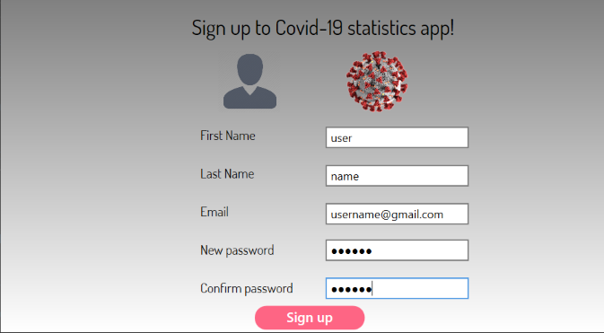
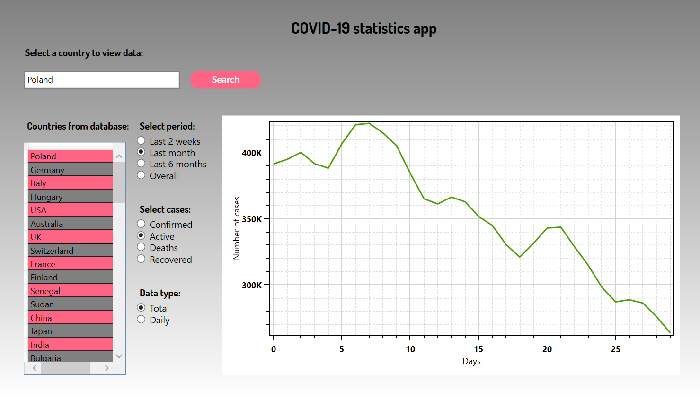
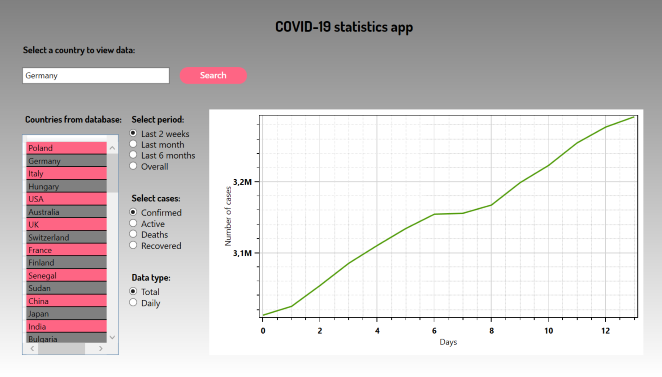
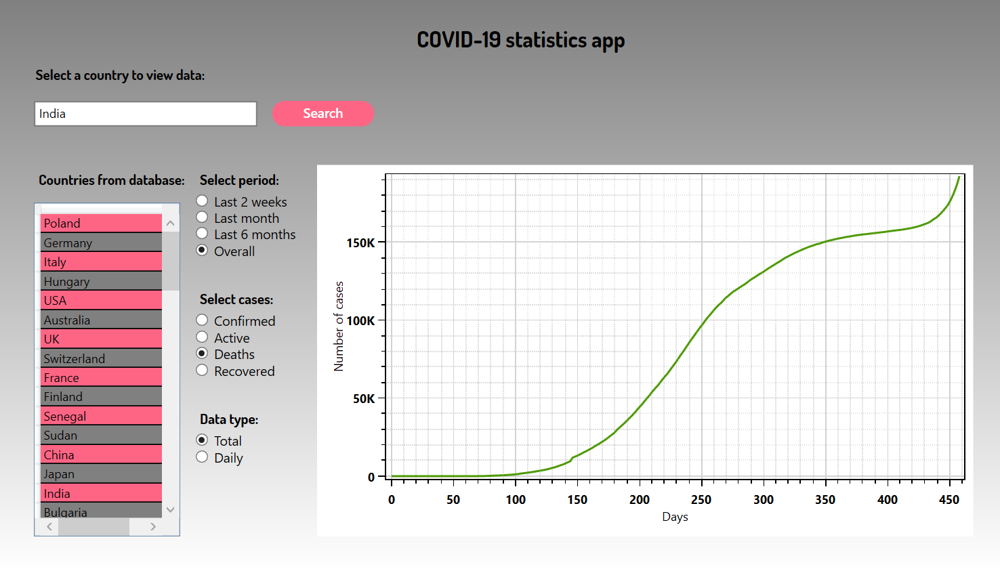
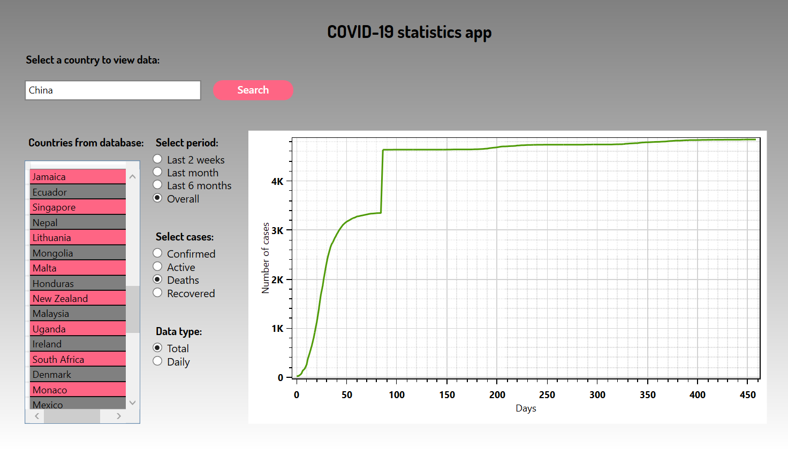

# Covid-statistics-app

The project is a Covid statistics app. It was made for the .Net and Java programming platforms course on the studies of Control Engineering and Robotics on specialization  Information Technology in Control Engineering ​at the Wrocław University of Science and Technology on the Faculty of Electronics.


## Requirements

- .NET Framework 4.7.2
- Microsoft SQL Server

## Packages

1. CovidStatisticsApp

- AutoMapper
- DotNetProjects.WpfToolkit.Input
- EntityFramework
- Microsoft.AspNet.WebApi.Client
- Newtonsoft.Json
- OxyPlot.Core
- OxyPlot.Wpf

2. CovidStatisticsApp.UnitTests

- MSTest.TestAdapter
- MSTest.TestFramework

## API with Covid data

Postman provides an API with Covid data that we used to build the application. You can see API from Postman here:

[Covid Data](https://documenter.getpostman.com/view/10808728/SzS8rjbc#7934d316-f751-4914-9909-39f1901caeb8)

In the application, you can choose a country from our database. You can also choose period, which you want to study from your chosen country:

- Last two weeks
- Last month
- Last six months
- Overall

The application draws plot for four type cases:

- Confirmed
- Active
- Deaths
- Recovered

In the end, you can choose two option for your plot:

- total
- daily

## How to run

1. Open Microsoft SQL Server and run ScriptForDatabase from folder ScriptForDatabse. It will create a database for the Covis Statistics App

2. Open Visual Studio 2019 and open Package Manager Console. In command line write

```shell
PM> Update-Database
```

It will update database in app.

3. Run app in Visual Studio 2019. You will see sign in window


4. You can click button Change password or button Sign up if you want to create account



5. After logging in, you can select the country, period, and case type. Now we show some examples

6. Last month of total active cases in Poland



7. Last two weeks of total confirmed cases in Germany



8. Overall of total deaths cases in India



9. Overall of total deaths cases in China



10. Overall of daily confirmed cases in USA


## Authors

- Adam Bednorz
- Kajetan Zdanowicz
